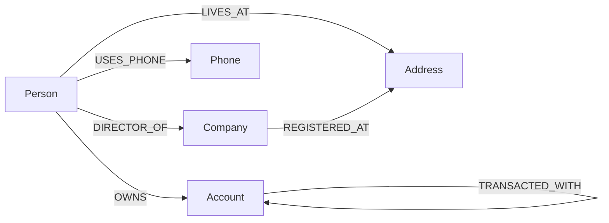

# Wexa — Fraud Ring Explorer

A web application for **insider-threat / fraud-ring detection** in banking, backed by **CognoDB** (openCypher over Bolt, via the official Neo4j JS driver).

The app lets a non-technical investigator pick a flagged account and see — visually and interactively — the network of people, shared addresses, shared phones, and counterparty accounts that connect it to other accounts. The interesting question ("*who else is in this ring?*") is a multi-hop traversal, which is where a graph database earns its keep.

---

## Why a graph database?

The core question is:

> Given a flagged account, find every other account reachable within a few hops through **shared personal attributes** (an address, a phone) of their owners.

That is a *variable-depth traversal over a heterogeneous graph* — exactly what Cypher is built for. The equivalent in a relational schema (say, `accounts`, `people`, `ownership`, `people_addresses`, `addresses`, `people_phones`, `phones`) looks roughly like this:

```sql
-- Find accounts within 3 hops of a flagged account, through shared
-- addresses or phones. Depth is unknown at planning time, so we need a
-- recursive CTE with manual cycle prevention and a manual hop counter.
WITH RECURSIVE reach(account_id, hops, visited) AS (
  SELECT a.account_id, 0, ARRAY[a.account_id]
  FROM accounts a WHERE a.flagged
  UNION ALL
  SELECT o2.account_id, r.hops + 1, r.visited || o2.account_id
  FROM reach r
  JOIN ownership o1 ON o1.account_id = r.account_id
  JOIN people    p1 ON p1.person_id  = o1.person_id
  JOIN (SELECT person_id, address_id FROM people_addresses
        UNION
        SELECT person_id, phone_id AS address_id FROM people_phones)  attr1
       ON attr1.person_id = p1.person_id
  JOIN (SELECT person_id, address_id FROM people_addresses
        UNION
        SELECT person_id, phone_id AS address_id FROM people_phones)  attr2
       ON attr2.address_id = attr1.address_id
  JOIN people    p2 ON p2.person_id  = attr2.person_id
  JOIN ownership o2 ON o2.person_id  = p2.person_id
  WHERE r.hops < 3
    AND o2.account_id <> ALL(r.visited)     -- manual cycle prevention
)
SELECT DISTINCT account_id FROM reach WHERE hops > 0;
```

Painful. In Cypher the same idea is one declarative pattern:

```cypher
MATCH path = (flagged:Account { flagged: true })
             <-[:OWNS]-(p1:Person)
             -[:LIVES_AT|USES_PHONE*1..2]-(p2:Person)
             -[:OWNS]->(other:Account)
RETURN flagged, other, path
```

Advantages of the graph model here:

- **Variable-depth traversals are first-class** — no recursive CTE, no manual cycle bookkeeping.
- **Schema flexibility** — adding a new shared attribute (`EMAIL`, `DEVICE_ID`) is one relationship type, not a new junction table plus a new UNION branch.
- **Path finding is built in** — `shortestPath()` gives the "how are these two accounts connected?" answer in one line.
- **The visual model matches the mental model** — the UI's force-directed graph is a direct rendering of the storage model, not a projection.

---

## Data model



**Nodes**

| Label     | Properties |
|-----------|------------|
| `Person`  | `id`, `name`, `dob`, `riskScore` |
| `Account` | `id`, `number`, `balance`, `openedAt`, `flagged` |
| `Company` | `id`, `name`, `incorporationDate`, `country` |
| `Address` | `id`, `line1`, `city`, `postal`, `country` |
| `Phone`   | `id`, `number` |

**Relationships**

| Type | From → To | Properties |
|------|-----------|------------|
| `OWNS` | Person → Account | `since` |
| `LIVES_AT` | Person → Address | `since` |
| `USES_PHONE` | Person → Phone | `since` |
| `DIRECTOR_OF` | Person → Company | `since` |
| `TRANSACTED_WITH` | Account → Account | `count`, `totalAmount`, `lastAt` |
| `REGISTERED_AT` | Company → Address | — |

A render of the diagram is at `docs/model.png` (generated from the Mermaid source in `docs/model.md`).

---

## Screenshots

> Replace with real captures after your first run — add them to `docs/` and reference them here, e.g.:
> - `docs/screenshot-overview.png` — overview: flagged accounts, canvas, inspector.
> - `docs/screenshot-ring.png` — a detected ring highlighting shared addresses.

---

## Setup

### 1. Prerequisites

- Node.js **20 or newer**
- A CognoDB instance (or any openCypher/Bolt-compatible database). You need:
  - `bolt+s://…` URI
  - username
  - password

### 2. Create your CognoDB instance

1. Sign up at https://console.cognodb.com/signup (free tier, no credit card).
2. From the console, create a free (`c0`) instance and pick a region.
3. Copy the `bolt+s://<instance-id>.databases.cognodb.cloud` URI and the generated password for user `cognodb` — the password is shown only once.

### 3. Install

```bash
npm install
```

### 4. Configure

```bash
cp .env.example .env
# then edit .env and paste your CognoDB URI / user / password
```

`.env` is git-ignored. The app refuses to start without `COGNODB_URI`, `COGNODB_USER`, and `COGNODB_PASSWORD` — this is deliberate, so a bad deploy fails loudly rather than running against an empty config.

### 5. Seed the database

This wipes all existing nodes and relationships, then loads a deterministic, realistic dataset:

- ~120 people, ~180 accounts, 25 companies, 60 addresses, 90 phones
- 3 deliberate fraud rings (4 people each sharing an address and a phone, each owning an account; one account per ring is flagged; all four funnel transactions through a shared hub account)
- Plus background transactions and ownership

```bash
npm run seed          # wipe + seed
npm run seed:reset    # wipe only
```

### 6. Run

```bash
npm start             # http://localhost:8080
npm run dev           # same, with --watch
```

The server logs DB connectivity at boot. If the DB is unreachable it still starts and the UI shows a red banner instead of a blank page.

---

## Using the app

1. **Left rail — Flagged accounts.** Lists every account with `flagged: true`. Click one to explore it.
2. **Search bar.** Find any account by number or owner name.
3. **Canvas.** Force-directed graph of the selected account's `N`-hop neighbourhood. Node colors by label (`Account`, `Person`, `Company`, `Address`, `Phone`), flagged accounts pulse red, hover/click for details. The **Hops** selector re-fetches at 1, 2, or 3 hops.
4. **Left rail — Top connectors.** People whose direct + indirect network touches the most flagged accounts.
5. **Right rail — Details & Query.** Metadata for the selected node, plus the exact Cypher that produced the current view (with a copy button).

---

## The headline queries

All queries live in `src/queries.js` and are parameterised — no string concatenation of user input into Cypher.

### 1. Multi-hop ring traversal (3 hops)

```cypher
MATCH (flagged:Account { flagged: true })
MATCH path = (flagged)<-[:OWNS]-(p1:Person)
             -[:LIVES_AT|USES_PHONE*1..2]-(p2:Person)
             -[:OWNS]->(other:Account)
WHERE other <> flagged
RETURN flagged.id, other.id, length(path) AS hops, ...
ORDER BY hops
LIMIT $limit
```

This is the canonical fraud-ring pattern: two accounts whose owners share an address or a phone. In SQL this requires a recursive CTE over two junction tables — see "Why a graph database?" above.

### 2. Shortest path between two accounts

```cypher
MATCH (a:Account { id: $fromId }), (b:Account { id: $toId })
MATCH path = shortestPath(
  (a)-[:OWNS|LIVES_AT|USES_PHONE|TRANSACTED_WITH*..8]-(b)
)
RETURN [n IN nodes(path) | { id: n.id, label: head(labels(n)) }] AS nodes,
       [r IN relationships(path) | type(r)] AS rels,
       length(path) AS hops
```

`shortestPath` is a first-class operator — no iterative deepening, no cycle table.

### 3. Degree centrality among flagged accounts (no APOC)

```cypher
MATCH (flagged:Account { flagged: true })
MATCH (p:Person)-[:OWNS]->(flagged)
WITH p,
     count { (p)-[:OWNS]->(:Account { flagged: true }) } AS directFlagged,
     count { (p)-[:LIVES_AT|USES_PHONE]-(:Person)-[:OWNS]->(:Account { flagged: true }) } AS indirectFlagged
WITH p, directFlagged + indirectFlagged AS score
WHERE score > 0
RETURN p, score ORDER BY score DESC LIMIT $limit
```

Uses Cypher's `count { … }` subquery so it runs on plain openCypher engines without APOC.

### 4. Neighbourhood expansion for the canvas

```cypher
MATCH (root:Account { id: $rootId })
MATCH path = (root)-[*1..$hops]-(n)
...
RETURN [n IN allNodes | { id: n.id, label: head(labels(n)), ... }] AS nodes,
       [r IN allRels | { source: startNode(r).id, target: endNode(r).id, type: type(r) }] AS edges
```

Variable-length pattern with no upper bound baked into the query text — `$hops` is a parameter.

---

## Project structure

```
wexa-fraud-graph/
├── src/
│   ├── config.js         # env loading & validation
│   ├── db.js             # driver singleton, session helpers, error mapping
│   ├── queries.js        # every Cypher statement, parameterised
│   ├── server.js         # express app, static hosting, health, error handler
│   └── routes/
│       ├── accounts.js
│       ├── rings.js
│       └── paths.js
├── scripts/
│   └── seed.js           # deterministic seed data loader
├── public/
│   ├── index.html
│   ├── styles.css
│   ├── graph.js          # canvas force-directed renderer (no deps)
│   └── app.js            # UI controller
├── docs/
│   ├── model.md           # mermaid source
│   └── model.png          # rendered (add after exporting)
├── .env.example
├── .gitignore
└── package.json
```

---

## Engineering notes

- **Env-only secrets.** The driver reads `COGNODB_URI/USER/PASSWORD` from the process env. Nothing is hard-coded, nothing is committed.
- **Parameterised Cypher everywhere.** All user input flows through `session.run(text, params)`. No template literals containing `MATCH`/`CREATE` in `src/`.
- **Graceful DB-down handling.** `verifyConnectivity()` runs at boot and on `/api/health`. If the DB is down the UI shows a banner and per-panel error messages, and the driver wraps transient errors as HTTP 503 rather than crashing.
- **Structured error mapping.** `withDriver()` maps `Neo.ClientError.*` → 400, `Neo.TransientError`/`ServiceUnavailable` → 503, `Unauthorized` → 502.
- **Sessions always closed.** Every query goes through `withSession()`, which guarantees `session.close()` in a `finally`.
- **No frontend build step.** Plain HTML/CSS/JS served by the same Express app that hosts the API — one deploy target, one URL.

---

## Deployment

The app is a single Node process serving both the API and the static frontend, so any Node host works:

- **Render / Railway / Fly.io:** create a web service pointing at this repo, set the three `COGNODB_*` env vars, build command `npm install`, start command `npm start`.
- **Health check:** point the platform's health probe at `/api/health`.

For a hosted demo, deploy once and share the resulting URL; the frontend needs no separate hosting.

---

## What I'd do with more time

- Add `EMAIL` and `DEVICE_ID` shared attributes to demonstrate schema flexibility.
- Replace the O(n²) canvas physics with a Barnes–Hut quadtree for >500-node neighbourhoods.
- Add a "explain this ring" narrative panel that walks a reviewer through the path hop by hop.
- Add rate limiting and audit logging on the API.

---

## Quick verification checklist (matches the brief)

| Requirement | Where it lives |
|---|---|
| Graph data model, labeled nodes, typed rels, properties | `docs/model.md`, `scripts/seed.js` |
| Diagram in README | This file → Mermaid block |
| Realistic seed script | `scripts/seed.js` (~120 people / 180 accounts + 3 engineered rings) |
| Multi-hop query (2+ hops) | `src/queries.js` → `ringsAroundFlaggedAccount` (variable `*1..2`) and `neighborhood` (`*1..$hops`) |
| Query awkward in SQL | `ringsAroundFlaggedAccount`, `shortestAccountPath` — justified above |
| Parameterised Cypher only | Every `session.run` call takes a params object |
| Functional UI for non-technical users | `public/index.html` + `public/app.js` |
| Loading / empty / error states | `data-state="loading"`, `.empty-state`, `.banner`, `.toast` |
| Env-only DB config | `src/config.js`, `.env.example` |
| Graceful DB-down handling | `src/db.js` + `/api/health` + banner in `public/app.js` |
