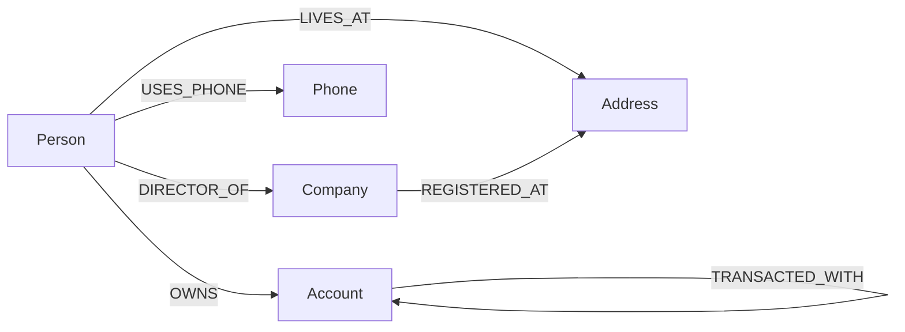

# Fraud Ring Explorer

This is my submission for the CognoDB take-home. I built a fraud-ring investigation tool for a bank, backed by CognoDB (openCypher over Bolt, using the official Neo4j driver).

The idea: an investigator has a flagged account and wants to know who else might be connected to it — same address, same phone, money flowing to the same place. Instead of digging through spreadsheets, they open this and get a live, clickable map of the account's network.

**Live demo:** <https://fraud-ring-explorer-one.vercel.app>

## Why I picked this use case, and why a graph DB

The question I kept coming back to was: *given one flagged account, find everyone reachable within a couple of hops through a shared address or phone number.* That's a variable-depth traversal, and it's basically what graph databases exist for.

I tried sketching what the relational version would look like, just to have something to compare against:

```sql
WITH RECURSIVE reach(account_id, hops, visited) AS (
  SELECT a.account_id, 0, ARRAY[a.account_id]
  FROM accounts a WHERE a.flagged
  UNION ALL
  SELECT o2.account_id, r.hops + 1, r.visited || o2.account_id
  FROM reach r
  JOIN ownership o1 ON o1.account_id = r.account_id
  JOIN people    p1 ON p1.person_id  = o1.person_id
  JOIN (SELECT person_id, address_id FROM people_addresses
        UNION
        SELECT person_id, phone_id AS address_id FROM people_phones)  attr1
       ON attr1.person_id = p1.person_id
  JOIN (SELECT person_id, address_id FROM people_addresses
        UNION
        SELECT person_id, phone_id AS address_id FROM people_phones)  attr2
       ON attr2.address_id = attr1.address_id
  JOIN people    p2 ON p2.person_id  = attr2.person_id
  JOIN ownership o2 ON o2.person_id  = p2.person_id
  WHERE r.hops < 3
    AND o2.account_id <> ALL(r.visited)
)
SELECT DISTINCT account_id FROM reach WHERE hops > 0;
```

A recursive CTE, a manual visited-array to stop cycles, and two UNIONs just to treat "address" and "phone" as the same kind of thing. It's not that it's impossible in SQL, it's that the moment your relationship is variable-depth, you end up hand-rolling the traversal logic yourself.

The Cypher version is the actual pattern I use in the app:

```cypher
MATCH path = (flagged:Account { flagged: true })
             <-[:OWNS]-(p1:Person)
             -[:LIVES_AT|USES_PHONE*1..2]-(p2:Person)
             -[:OWNS]->(other:Account)
RETURN flagged, other, path
```

That's the whole thing. No cycle bookkeeping, no depth counter, and if I want to add a new kind of shared attribute later (say, device ID or email), it's one more relationship type, not a new table and another UNION branch.

The other thing that sold me on this: `shortestPath()` is built in, so "how are these two accounts connected at all?" is a one-liner instead of another recursive query. And the UI's graph view is basically a direct rendering of how the data is actually stored, not some projection I built on top — which made the frontend a lot simpler than I expected.

## Data model



(This renders as an actual diagram on GitHub — it's Mermaid syntax. Source is also in `docs/model.md`.)

Nodes:

| Label     | Properties |
|-----------|------------|
| `Person`  | `id`, `name`, `dob`, `riskScore` |
| `Account` | `id`, `number`, `balance`, `openedAt`, `flagged` |
| `Company` | `id`, `name`, `incorporationDate`, `country` |
| `Address` | `id`, `line1`, `city`, `postal`, `country` |
| `Phone`   | `id`, `number` |

Relationships:

| Type | From → To | Properties |
|------|-----------|------------|
| `OWNS` | Person → Account | `since` |
| `LIVES_AT` | Person → Address | `since` |
| `USES_PHONE` | Person → Phone | `since` |
| `DIRECTOR_OF` | Person → Company | `since` |
| `TRANSACTED_WITH` | Account → Account | `count`, `totalAmount`, `lastAt` |
| `REGISTERED_AT` | Company → Address | — |

## Setup

You'll need Node 20+ and a CognoDB instance (free tier is fine).

1. Sign up at console.cognodb.com/signup, create a free `c0` instance, and grab the `bolt+s://…` URI plus the generated password for the `cognodb` user. It's only shown once at creation, so I'd copy it somewhere safe right away — this got me the first time.

2. Install and configure:
   ```bash
   npm install
   cp .env.example .env
   ```
   Then open `.env` and fill in `COGNODB_URI`, `COGNODB_USER`, `COGNODB_PASSWORD`. The app won't start without these — I made that deliberate, so a broken deploy fails loudly instead of quietly running against nothing.

3. Seed the database:
   ```bash
   npm run seed
   ```
   This wipes whatever's there and loads ~120 people, ~180 accounts, plus companies/addresses/phones, and deliberately builds 3 fraud rings into the data (4 people per ring sharing an address and a phone, each owning an account, one account per ring flagged) so there's actually something to find when you open the app.

4. Run it:
   ```bash
   npm start
   ```
   Then open `http://localhost:8080`.

If CognoDB isn't reachable, the server still boots and the UI shows a banner instead of just breaking silently — I wanted this to fail in a way that's obvious to debug, not a blank white screen.

## Using it

- **Flagged accounts** (left panel) — the accounts already marked suspicious. Click one to pull up its network.
- **Search** (top right) — find any account, flagged or not, by number or owner name.
- **The graph** — force-directed layout of the selected account's neighborhood. Flagged accounts are drawn in red. Click any node to see its details on the right. The Hops selector controls how far out from the account to expand (1–3).
- **Top connectors** — ranks people whose personal network (shared address/phone) touches the most flagged accounts, which is a decent way to spot whoever's sitting in the middle of more than one ring.
- **Query panel** — shows the actual Cypher that produced whatever's currently on screen, with a copy button. I added this mostly so it's obvious the queries are real and not hardcoded mock data.

## The queries that matter

Everything lives in `src/queries.js`, and every single one is parameterized — nothing gets string-concatenated into Cypher.

**The ring traversal** — this is the core of the whole app:
```cypher
MATCH (flagged:Account { flagged: true })
MATCH path = (flagged)<-[:OWNS]-(p1:Person)
             -[:LIVES_AT|USES_PHONE*1..2]-(p2:Person)
             -[:OWNS]->(other:Account)
WHERE other <> flagged
RETURN flagged.id, other.id, length(path) AS hops, ...
ORDER BY hops
LIMIT $limit
```

**Shortest path between two accounts:**
```cypher
MATCH (a:Account { id: $fromId }), (b:Account { id: $toId })
MATCH path = shortestPath(
  (a)-[:OWNS|LIVES_AT|USES_PHONE|TRANSACTED_WITH*..8]-(b)
)
RETURN [n IN nodes(path) | { id: n.id, label: head(labels(n)) }] AS nodes,
       [r IN relationships(path) | type(r)] AS rels,
       length(path) AS hops
```

**Top connectors, without APOC** (CognoDB's engine is fairly new, so I stuck to plain openCypher):
```cypher
MATCH (flagged:Account { flagged: true })
MATCH (p:Person)-[:OWNS]->(flagged)
WITH p,
     count { (p)-[:OWNS]->(:Account { flagged: true }) } AS directFlagged,
     count { (p)-[:LIVES_AT|USES_PHONE]-(:Person)-[:OWNS]->(:Account { flagged: true }) } AS indirectFlagged
WITH p, directFlagged, indirectFlagged, directFlagged + indirectFlagged AS score
WHERE score > 0
RETURN p, score ORDER BY score DESC LIMIT $limit
```
(I actually got the scoping wrong on my first pass here — dropped `directFlagged`/`indirectFlagged` out of the second `WITH` clause and then tried to return them anyway. CognoDB's error message, "variable not defined," pointed straight at it.)

**Neighborhood expansion for the graph view** — this one's worth a note:
```cypher
MATCH (root:Account { id: $rootId })
MATCH path = (root)-[*1..2]-(n)
...
```
I originally had `*1..$hops` with hops as a bound parameter, which seems like the obvious way to do it — but Cypher won't allow a parameter inside a variable-length relationship range, it has to be a literal number. So the hop count gets validated and clamped to 1–3 server-side, then interpolated directly into the query text rather than passed as a parameter. Since it's clamped before it ever touches the query, there's no injection risk — it can only ever be the digit 1, 2, or 3.

## A few things I ran into building this

- **The search box could hang the whole app.** Typing into the search field fires a request per keystroke, and if one of them got slow (which happens on CognoDB's free tier under load), the next keystroke's request would queue up behind it waiting for a database connection, and the one after that, and so on — the connection pool never got a chance to free up. Fixed it two ways: added a hard timeout on the search query itself so a slow query fails fast instead of hanging, and added an `AbortController` on the frontend so a new keystroke cancels whatever request came before it instead of piling on top.
- **The health check lied on Vercel.** I originally checked CognoDB connectivity once at server boot and cached the result for `/api/health` to read. That's fine for a normal server, but on Vercel each request can hit a fresh, short-lived function instance where that boot code never actually ran — so the health check kept reporting "not checked yet" even though the real queries were working fine. Now `/api/health` does a live check every time it's called instead of trusting a cached flag.
- **Parameters everywhere, except where Cypher won't allow it.** Every value that comes from a user (account IDs, search text, hop counts) goes through the driver as a bound parameter — except the one case above where Cypher's syntax itself doesn't support it, and even there I validate and clamp before interpolating.

## Project structure

```
wexa-fraud-graph/
├── src/
│   ├── config.js         # env loading & validation
│   ├── db.js             # driver singleton, session helpers, error mapping
│   ├── queries.js        # every Cypher statement, parameterised
│   ├── server.js         # express app, static hosting, health, error handler
│   └── routes/
│       ├── accounts.js
│       ├── rings.js
│       └── paths.js
├── scripts/
│   └── seed.js           # deterministic seed data loader
├── public/
│   ├── index.html
│   ├── styles.css
│   ├── graph.js          # canvas force-directed renderer, no dependencies
│   └── app.js            # UI controller
├── docs/
│   └── model.md           # mermaid source for the diagram above
├── .env.example
├── .gitignore
└── package.json
```

## Deployment

It's one Node process serving both the API and the static frontend, so it runs on pretty much any Node host without changes — I deployed mine on Vercel. Render, Railway, or Fly.io would work the same way: point it at the repo, set `COGNODB_URI` / `COGNODB_USER` / `COGNODB_PASSWORD`, build with `npm install`, start with `npm start`.

## What I'd add with more time

- More shared-attribute types (email, device ID) to show off how easy the schema is to extend.
- Better physics for the graph canvas — it's O(n²) right now, which is fine for a demo-sized neighborhood but wouldn't hold up past a few hundred nodes.
- A step-by-step "here's how this ring connects" narrative instead of making the investigator read the graph themselves.
- Rate limiting and some basic audit logging, since this would obviously need both in anything real.