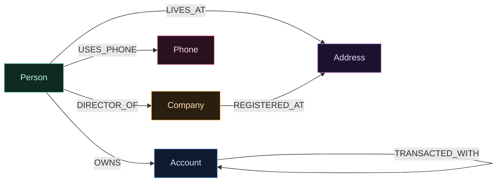

# Data model diagram (Mermaid source)

Render this with the Mermaid CLI, VS Code's Mermaid preview, or https://mermaid.live, then save the export as `docs/model.png` for the README.

```mermaid
graph LR
  Person   -- OWNS -->          Account
  Person   -- LIVES_AT -->      Address
  Person   -- USES_PHONE -->    Phone
  Person   -- DIRECTOR_OF -->   Company
  Account  -- TRANSACTED_WITH --> Account
  Company  -- REGISTERED_AT --> Address

  classDef person fill:#0e2a22,stroke:#7ee0c0,color:#bff3e4
  classDef account fill:#101a30,stroke:#6ea8fe,color:#cfe0ff
  classDef address fill:#1c1230,stroke:#c792ea,color:#e8d5ff
  classDef phone fill:#2a1220,stroke:#ff8fb1,color:#ffd6e3
  classDef company fill:#2a1e0e,stroke:#ffb454,color:#ffe1b8

  class Person person
  class Account account
  class Address address
  class Phone phone
  class Company company
```
